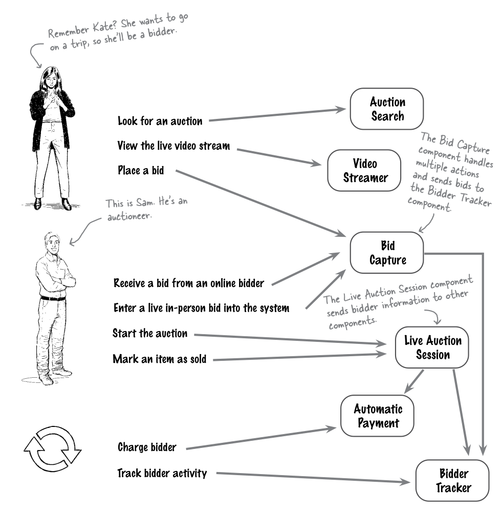
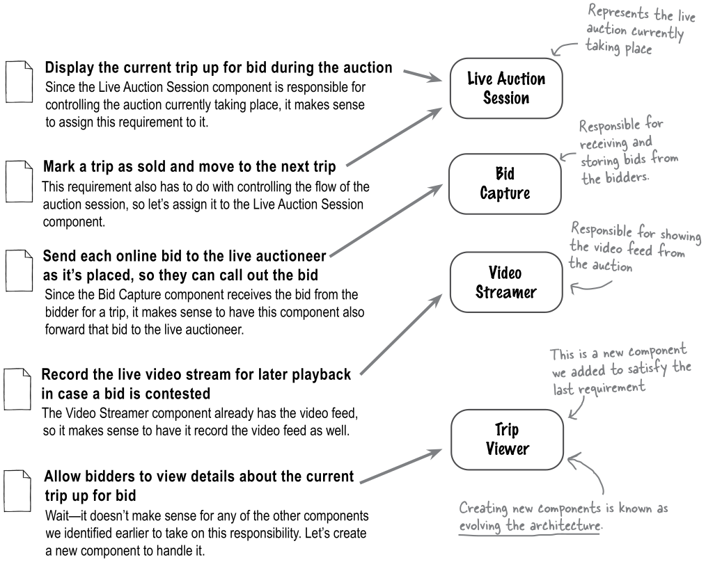
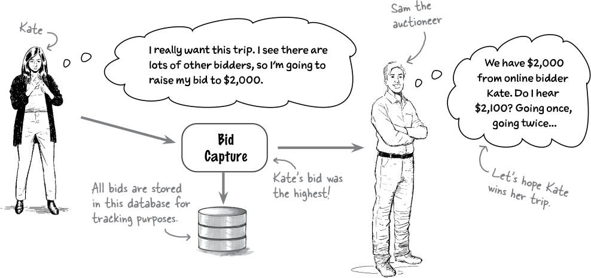
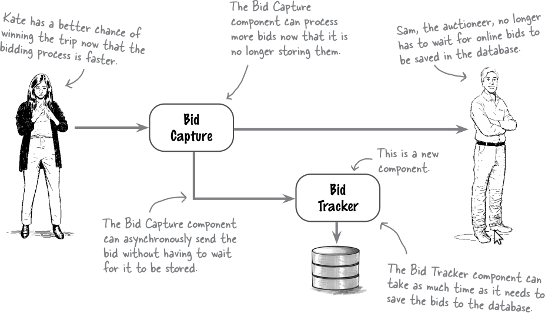
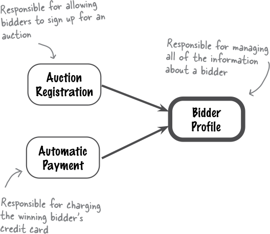
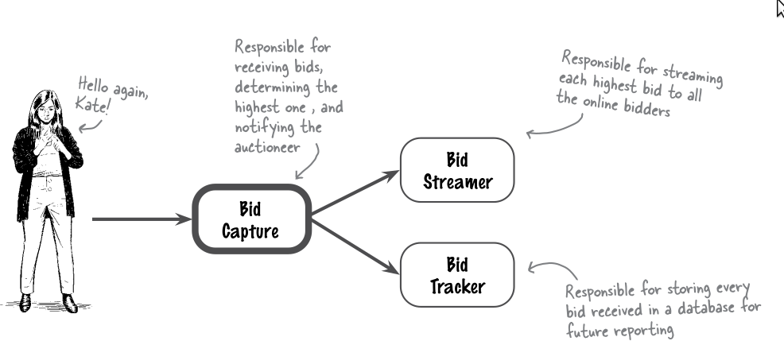
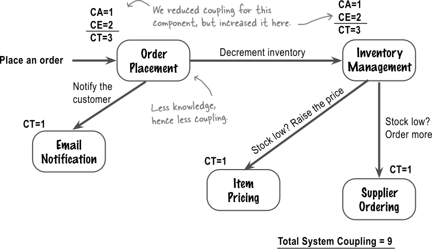

# Logische componenten

note:
- 3e dimensie
  - architecturale karakteristieken (reeds behandeld)
  - architecturale beslissingen (reeds behandeld)
  - logische componenten
  - architecturale stijl (zal omvatten hoe we deze logische componenten implementeren)
- bouwblokken van de **logische** architectuur
  - vormen onze voorstelling van het probleemdomein, dus de setting waarin we werken
- abstracter dan **fysieke** architectuur

---

## Diagramvoorstelling

<div class="mermaid">
%%{init: {'theme': 'dark', 'themeVariables': { 'darkMode': true }}}%%
block-beta
  columns 5
  space:4 ordertracking
  space:5
  orderplacement space paymentprocessing space ordershipping
  space:5
  inventorymanagement space:4
  orderplacement-->paymentprocessing
  paymentprocessing-->ordershipping
  orderplacement-->inventorymanagement
  ordershipping-->ordertracking

  orderplacement(["Order Placement"])
  paymentprocessing(["Payment Processing"])
  ordershipping(["Order Shipping"])
  ordertracking(["Order Tracking"])
  inventorymanagement(["Inventory Management"])

</div>

note:
- logische bouwstenen van een probleemdomein voor een winkelsysteem
- notatie hier: afgeronde blokken met pijlen tussen, (meestal) geen queues of databases,...

---

## Organisatie broncode

```text
.
├── inventory
│   └── management
├── order
│   ├── placement
│   ├── shipping
│   └── tracking
│       ├── source_code_file_1.txt
│       └── source_code_file_2.txt
└── payment
    └── processing
```

note:
- **typische** voorstelling, geen wet
- natuurlijk enkel zo als je gewerkt hebt met architecturale principes in het achterhoofd
- indien gewoon code geschreven, zal ontrafeld moeten worden welke domeinvoorstelling impliciet aanwezig is
- **folderstructuur** weerspiegelt architectuur, **source files** zijn designkeuze en doen dat niet

---

## Relatie tot services

<div class="mermaid">
%%{init: {'theme': 'dark', 'themeVariables': { 'darkMode': true }}}%%
block-beta
columns 3
  block:service1
    A(["component A"])
    B(["component B"])
  end
  space
  block:service2
    C(["component C"])
    D(["component D"])
  end
  space Database[("DB")] space
  service1-->Database
  service2-->Database
</div>

note:
- service is deployable software, logische component is enkel conceptueel!
- noemen dit verschil "logische" en "fysieke" architectuur
- **logische** architectuur geeft alleen weer welke conceptuele onderdelen er zijn en hoe ze met elkaar interageren (gekend als **coupling**)
- **fysieke** architectuur geeft aan welke architecturale stijl gevolgd wordt, welke services are zijn, welke protocols, databases,...
- in Mermaid gebruik ik "architecture" voor fysieke en "block diagram" voor logische (of voor deze gecombineerde voorstelling)
- goede logische componenten uitwerken geeft ons eerst abstracter beeld, daarna zullen we concreter maken

---

## Case: Adventurous Auctions

note:
- systeem om goedkoop avontuurlijke reizen te boeken via veiling (bv. omdat planning al afgerond was maar eerdere klant heeft moeten afzeggen)
- echte ervaring van een veiling, meer dan bv. ebay

---

## Requirements
- schalen tot mogelijk duizenden users per veiling
- in-person en online biedingen
- registratie (credit card info a priori vereist)
- videostreams van lopende veilingen
- overzicht van reeds gemaakte boden
- automatisch bepalen "winnaar" (of bij conflict overlaten aan veilingmeester)
- automatisch betaling regelen

---

## Voorbeeldcomponenten

<div class="mermaid">
%%{init: {'theme': 'dark', 'themeVariables': { 'darkMode': true }}}%%
block-beta
columns 9
  auctionmaintenance space auctionscheduler space:6
  space:9
  space:2 auctionsearch space auctionviewer space bidderregistration space biddersignon
  auctionmaintenance-->auctionscheduler
  auctionsearch-->auctionscheduler
  auctionviewer-->auctionsearch
  biddersignon-->bidderregistration
  auctionmaintenance(["Auction Maintenance"])
  auctionscheduler(["Auction Scheduler"])
  auctionsearch(["Auction Search"])
  auctionviewer(["Auction Viewer"])
  bidderregistration(["Bidder Registration"])
  biddersignon(["Bidder Sign-on"])
</div>

note:
- geen finaal ontwerp!
- zullen verderop zien hoe we er goede kunnen achterhalen
- maintenance: registreren van nieuwe veilingen,...
- scheduler: zeggen wanneer een veiling effectief moet worden gestart,...

---

## Mogelijke mapping
<div class="mermaid">
%%{init: {'theme': 'dark', 'themeVariables': { 'darkMode': true }}}%%
block-beta
columns 7
  block:service1
    auctionsearch(["Auction Search"])
    auctionviewer(["Auction Viewer"])
  end
  space
  block:service2
    auctionmaintenance(["Auction Maintenance"])
    auctionscheduler(["Auction Scheduler"])
  end
  space
  block:service3
    bidderregistration(["Bidder Registration"])
  end
  space
  block:service4
    biddersignon(["Bidder Sign-on"])
  end
  space:7
  space Database1[("DB")] space:2 Database2[("DB")] space:2
  service1-->Database1
  service2-->Database1
  service3-->Database2
  biddersignon-->bidderregistration
</div>

note:
- opnieuw, niet definitief, gewoon om te tonen hoe logische architectuur zich verhoudt tot fysieke

---

<div class="mermaid">
%%{init: {'theme': 'dark', 'themeVariables': { 'darkMode': true }}}%%
flowchart LR
  step1[Stap 1: Initiële kerncomponenten achterhalen]
  step2[Stap 2: Requirements toewijzen aan componenten]
  step3[Stap 3: Rol en verantwoordelijkheden analyseren]
  step4[Stap 4: Architecturale karakteristieken analyseren]
  step1 --> step2
  step2 --> step3
  step3 --> step4
  step4 --> step2
</div>

note:
- kan voor greenfield of brownfield
  - in tweede geval zijn er misschien al "initial core components"
  - eventueel moeten we ze proberen opmaken uit structuur code
- proces moet gevolgd worden zolang de applicatie bestaat
- zullen elke stap apart bekijken

---

## Stap 1: Initiële kerncomponenten achterhalen

- 2 technieken
  - workflow
  - actor/agent
- mogen beide toepassen

note:
- eerst "raden", we zullen iteratief verfijnen
- zowel workflow als actor/action bieden een kader voor dat raden
- in sommige settings is de een natuurlijker dan de ander

---

### Workflow approach
- perspectief van een gebruiker
- conceptuele stappen van één "user journey"
- verschillende stappen ⇒ verschillende componenten
  - niet nodig voor sterk verwante stappen

note:
- user journey: één "typisch gebruik" van het systeem

---

<div class="mermaid">
%%{init: {'theme': 'dark', 'themeVariables': { 'darkMode': true }}}%%
journey
  title "Meedoen en winnen"
  Registreren voor de veiling:3:Bieder
  Aanmelden bij de start:3:Bieder
  Veiling bekijken:3:Bieder
  Bod plaatsen:3:Bieder
  Betalen:3:Bieder
</div>

note:
- "user journey" wordt veel gebruikt voor verbetering UX, smileys geven "ervaring" weer, hier niet relevant, maar is zo in Mermaid
- kunnen stappen mappen op logische componenten
- **kan** dat twee stappen onder zelfde component vallen

---

#### Namen

- Auction Registration
- Live Auction Session
- Video Streamer
- Bid Capture
- Automatic Payment

---

### Actor/action approach
- handig bij meerdere soorten gebruikers
- sommen **belangrijkste** handelingen op
- verbinden deze met componenten
- verbinden ook componenten onderling
- "system" actor voor automatische acties

---



---

<div class="mermaid">
%%{init: {'theme': 'dark', 'themeVariables': { 'darkMode': true }}}%%
sequenceDiagram
  actor Kate
  actor Sam
  actor System
  participant AuctionSearch
  participant VideoStreamer
  participant BidCapture
  participant LiveAuctionSession
  participant AutomaticPayment
  participant BidderTracker

  Kate->>AuctionSearch: Look for an auction
  Kate->>VideoStreamer: View the live video stream
  Kate->>BidCapture: Place a bid

  Sam->>BidCapture: Receive a bid from an online bidder
  Sam->>BidCapture: Enter a live in-person bid into the system
  Sam->>LiveAuctionSession: Start the auction
  Sam->>LiveAuctionSession: Mark an item as sold

  System->>AutomaticPayment: Charge bidder
  System->>BidderTracker: Track bidder activity

  BidCapture->>BidderTracker: Forward bid
  LiveAuctionSession->>AutomaticPayment: Tell who to charge
  LiveAuctionSession->>BidderTracker: Start/stop tracking

</div>

note:
- dit is niet het typische gebruik van een sequence diagram!
  - daarin moet je van boven naar onder lezen als één reeks stappen met tijd tussen
- maar het toont wel "actors", componenten en communicatie
  - dus hier is geen component "tijd"!
- je mag dit van mij zelf ook gebruiken, als je duidelijk bent over de interpretatie

---

#### Entity Trap

- component met twee verantwoordelijkheden
- extra risico bij vage naamgeving
  - "supervisor"
  - "manager"
  - "control center"
  - ...

---

### Combineren
- identificeer actors en primaire acties zoals in actor/action
- doorloop dan acties zoals in workflow
- kunnen zo meer in detail gaan indien zinvol

note:
- dit is een **optie**, geen verplichting

---

## Stap 2: Requirements toewijzen aan componenten



note:
- betreft functionele requirements
- kan zijn dat component nog communiceert met andere, maar elke requirement zou een "thuis" moeten krijgen
- kan zijn dat we iets niet kunnen plaatsen en nieuwe component opmerken

---

## Stap 3: Rol en verantwoordelijkheden analyseren

- per component vraag stellen: "welke taken?"
- interne samenhang van een component = "cohesie"
  - hoe duidelijker het takenpakket, hoe hoger de cohesie
- moet opgevolgd worden naarmate systeem groeit
  - kan introductie nieuwe componenten noodzakelijk maken
    - kan bijhouden in een ADR!
- onthoud: **mik op sterke cohesie**

---

## Stap 4: Architecturale karakteristieken analyseren
- kijken hier naar de "driving characteristics"
- bekijken of de takenverdeling deze ondersteunt
- hier wel enige redenering over fysieke kenmerken vereist

---

### Voorbeeld (1)

driving characteristics:

- scalability
- availability
- performance

---

### Voorbeeld (2)



---

### Voorbeeld (3)



note:
- bid capture hoeft niet elk bod bij te houden, eigenlijk gewoon hoogste bod of hoogste paar "in memory"
  - volledige geschiedenis is belangrijk te hebben, maar geen reden om veiling te vertragen
- hier zou asynchrone messaging, bv. met RabbitMQ van pas kunnen komen

---

## Interactie tussen componenten

note:
Apart aspect. Componenten kunnen zelf intern goed zitten, maar communciatie onderling moet ook bekeken worden. We spreken hier over "koppeling"

---

## Afferente koppeling

"Hoe hoger, hoe meer hier van afhangt."

note:
- Latijn: "ad" en "ferre"
- Nederlands: aantal inkomende pijlen
  - pijl betekent "is afhankelijk van"
- Engels: "fan-in", "incoming coupling", "afferent coupling" (CA)

---


note:
- we zeggen hier dat de CA van Bidder Profile 2 bedraagt

---

## Efferente koppeling

"Hoe hoger, hoe afhankelijker."

note:
- Latijn: "ex" en "ferre"
- Nederlands: aantal uitgaande pijlen
- Engels: "fan-out", "outgoing coupling", "efferent coupling" (CE)
- geheugensteuntje in het Nederlands: "naar" (A) en "weg" (E)

---



---

## Koppeling meten
- per component afferente, efferente en totale (som) koppeling
- ook totale koppeling van het systeem (som van sommen)

---

## Wet van Demeter


note:
- zorgde dat het graan groeide, maar trok zich niets aan van wat er verder mee gedaan werd
- ook "principle of least knowledge"
- staat symbool voor "losse koppeling"

---

### Toegepast (1)


note:
- merk op wat er staat: de componenten op zich hebben goed afgebakende verantwoordelijkheden, i.e. sterke cohesie
- maar toch een ervan heeft ook opvallend sterke koppeling

---

### Toegepast (2)



note:
- draait niet gewoon om de som, maar om goede balans
- te vaag? in statistiek zijn er spreidingsmaten zoals [standaarddeviatie](https://www.calculator.net/standard-deviation-calculator.html)
  - lager = minder afwijkingen ten opzichte van het gemiddelde
  - dus bij twijfel of spreiding beter is: mik op zelfde som en lagere SD
---

### Toegepast (3)
<div style="display: flex; flex-direction: row">
</img>
</img>
</div>

note:
- Twee componenten zijn gekoppeld als aanpassing aan de ene een aanpassing in de andere zou kunnen vereisen.
- Let op: geen spelletje getalwaarden optimaliseren. Denk steeds na of nieuw ontwerp even goed zou functioneren!
