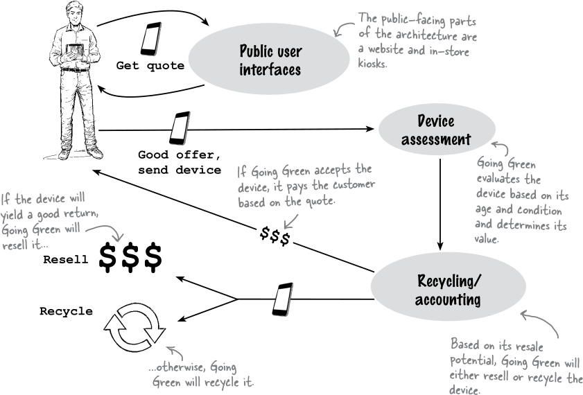
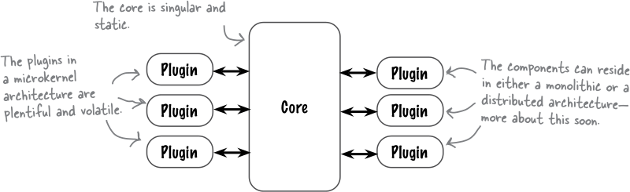
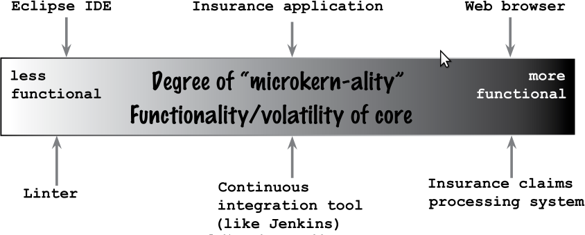
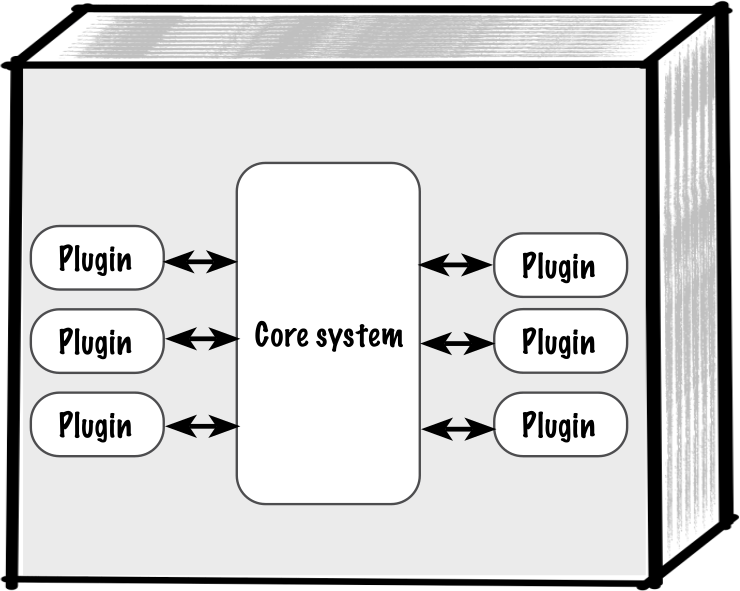
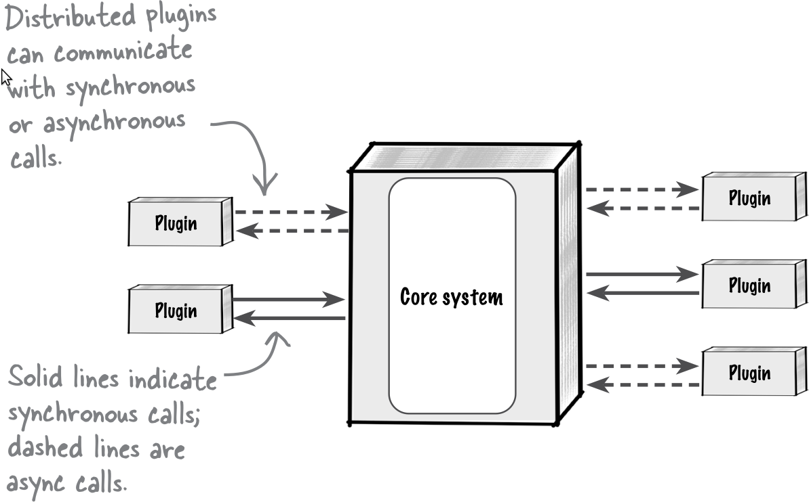
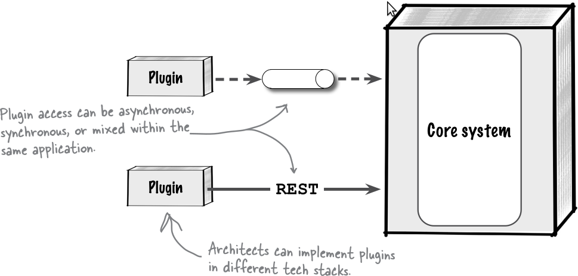
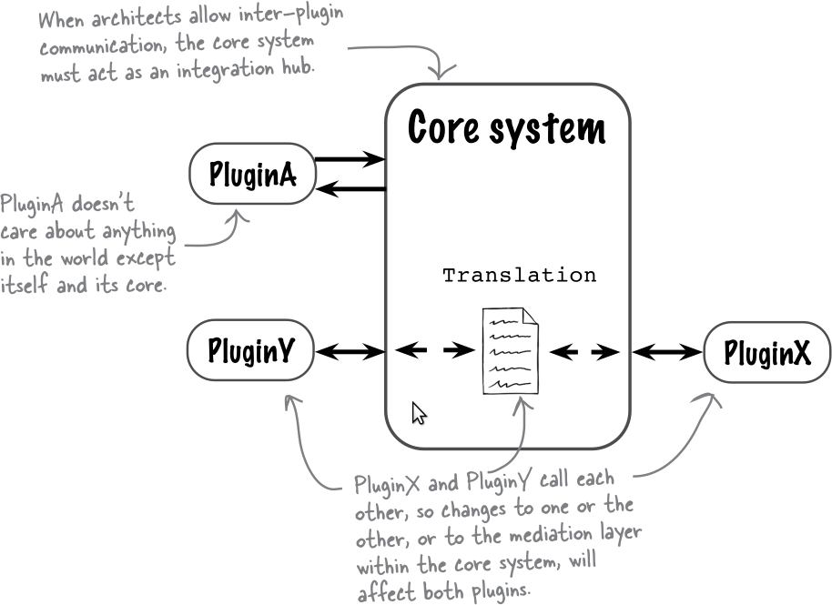
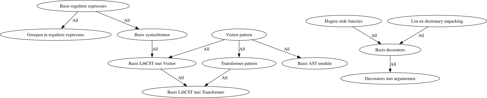

# Microkernels

note:
- term uit OS development
- overgedragen naar software architectuur in algemeen

---

## Cases

- Going Green Electronics
- LBLP

note:
- Going Green Electronics: al eens aan bod gekomen in de labosessies
- "logic based learning paths": "real world" voorbeeld

---

### Going Green Electronics



note:
- focussen hier op Device Assessment, dus beoordeling van de waarde van toestellen
  - "quote" is ook wel beoordeling maar is veel ruwer
- veel soorten toestellen
  - allerlei GSM's, maar misschien allerlei soorten elektronica
- waarde van toestel kan schommelen
  - leeftijd
  - uitvoering van toestel (versie met meer/minder features)
  - merk (bv. Macs bewaren waarde langer)
  - vraag en aanbod
- we kunnen niet permanent "on call" zijn om updates voor dit ene project uit te voeren (duur, communicatie duurt lang)

---

## Primaire karakteristieken

- extensibility
- agility
- deployability

note:
- agility: nieuwere toestellen zijn meer waard en leveren meer op bij verkoop, dus doorlooptijd moet zo laag mogelijk zijn
- deployability in de zin dat nieuwe manieren van beoordelen live moeten kunnen gaan zonder een totale reboot van het systeem

---

## Voorgestelde oplossing


note:
exacte uitwerking kan op verschillende manieren

---

## De "core"

- bewust beperkt
  - als iets als plugin *kan*, *implementeer het dan zo*
- stabiel

---

## De plugins

- leveren custom gedrag
- mogelijk door externen geschreven
  - soms zijn er wel "officiële" plugins
- plugins zijn alleen afhankelijk van de core, niet onderling

---

## Pluginsysteem ≠ microkernel



note:
- "insurance application" moet hele hoop polissen kennen,... waarbij standaardregels gelden maar speciale gevallen mogelijk zijn
  - processing gaat over het afwerken
    - ik ben geen verzekeraar, dus ik geloof de figuur; de rest is duidelijker!
- linter: je gebruikt misschien wel een "out-of-the-box" configuratie, maar die werkt vaak met officiële plugins
  - belangrijk dit zo te doen, anders kan je geen huisstijlen,... laten controleren
- web browsers ondersteunen vaak plugins, soms heel uitvoerig, maar zijn perfect bruikbaar zonder
  - "echte" microkernel is vrij nutteloos zonder plugins

---

## Monolitische implementatie (1)


note:
- denk eraan: buitenste doos stelt een service voor, dus één "unit of deployment"

---

## Monolitische implementatie (2)

```
class iPhone15 implements DeviceInterface {
  ...
}
```

note:
- **typische** aanpak: plugins implementeren vaste interface
- code laadt objecten dynamisch in, bv. omdat ze in een bepaalde source folder staan
- lijkt vrij sterk op werken met zelf geschreven code

---

## Gedistribueerde implementatie (1)


---

## Gedistribueerde implementatie (2)


note:
- tweede aantekening is wat misleidend: hier is het triviaal verschillende stacks te gebruiken (dus bv. andere talen), maar dat is niet onmogelijk in een monolitische benadering
  - meerbepaald als plugins kunnen compileren naar een gemeenschappelijk "target" dat begrepen wordt door de core
    - typische voorbeelden: JavaScript en WebAssembly

---

## Communicatie tussen plugins


note:
- plugins zouden onafhankelijk van elkaar geschreven moeten kunnen worden
- het is wel *mogelijk* plugins onderling afhankelijk te maken, maar dan riskeren we specifieke plugins meer als een "core" te behandelen

---

## "Real world" case: LBLP

note:
- tool waarmee cursus Python Advanced is klaargezet
- vergelijk met "infrastructure as code", maar het is "leerpaden as code"
- begonnen als script, uitgegroeid tot microkernel applicatie
  - DigitAP klaarzetten is veel werk!
  - leerpaden maken is veel werk!
- sommige lectoren maken graag quizzen, sommige indienopdrachten, sommige gebruiken Github Classroom,...
- sommige lectoren schrijven liever Markdown, sommige AsciiDoc, sommige Word
- sommige liever tekst in DigitAP zelf, sommige in Gitbook
- niet elke onderwijsinstelling gebruikt Moodle (DigitAP)
- ik kan onmogelijk alle configuraties ondersteunen

---

## LBLP: core

- UI
- onveranderlijke logica:
  - clusters, bestaande uit:
    - nodes (stukjes leerstof)
    - edges
      - all (voor voorkennis)
      - any (normaal om stof te motiveren)
- leren gebeurt door projecten te doorlopen

note:
- sommige vakken lenen zich beter tot projecten dan andere
- het systeem en dit vak zijn nog vrij nieuw
---
## Voorbeeld technische cluster



---
## Voorbeeld projectcluster


---
## Inhoudstafel (nodes)

```yaml
nodes:
  - id: intro
    title: "Introductie project URL shortener"
  - id: stap-1-mapping-tonen-implementatie
    title: "Implementatie stap 1: mapping tonen"
    assignments:
      - id: indienopdracht
        title: "Indienopdracht"
  - id: stap-2-mapping-uitbreiden-motivatie
    title: "Motivatie stap 2: mapping uitbreiden"
  - id: stap-2-mapping-uitbreiden-implementatie
    title: "Implementatie stap 2: mapping uitbreiden"
    assignments:
      - id: indienopdracht
        title: "Indienopdracht"
# ...
```

note:
opdrachten ("assignments") zijn niet ingebouwd in de kernlogica, maar we kunnen dat veld gebruiken omwille van een plugin

---
## Inhoudstafel (de rest)

```yaml
all_type_edges:
  - start_id: intro
    end_id: stap-1-mapping-tonen-motivatie
  - start_id: cluster-python-concepten__flask-basis
    end_id: stap-1-mapping-tonen-implementatie
  # etc.
any_type_edges:
  - start_id: stap-1-mapping-tonen-motivatie
    end_id: stap-1-mapping-tonen-implementatie
  - start_id: stap-1-mapping-tonen-implementatie
    end_id: stap-2-mapping-uitbreiden-motivatie
roots:
  - intro
node_plugins:
  - path: "/home/vincentn/assignments.wasm"
pre_cluster_plugins:
  - path: "/home/vincentn/markdown_rendering.wasm"
pre_zip_plugins:
  - path: "/home/vincentn/moodle_export_plugin.wasm"
```

note:
plugintypes verschillen van elkaar in verschillende opzichten:

- tijdstip waarop ze lopen (bij elke wijziging / enkel voor export)
- toegang tot het systeem (node plugins kunnen enkel aan het lesmateriaal van een specifiek stukje leerstof; cluster plugins aan een volledige cluster; pre-zip aan alle gecombineerde clusters)
- aangeboden functionaliteit uit de core (meer gespecialiseerde, makkelijkere functies naarmate de scope preciezer wordt)

---

## Oude aanpak
- at runtime inladen van dynamische bibliotheken (`.so` bestanden)
  - moesten in Rust geschreven zijn
  - moesten op zelfde manier gecompileerd zijn als core
  - hoefde niet bij opstart

note:
- "zelfde rechten als de applicatie" = problematischer dan het klinkt, betekent eigenlijk dat je de broncode van elke plugin moet lezen
  - voorbeeld: `~/.ssh` accessen en private keys versturen kan met dit niveau van toegang

---

## Nieuwere aanpak
- plugins compileren naar WebAssembly
- inladen gebruikt wasmtime (WebAssembly Runtime)
- technisch monolitisch
- kenmerken tussen twee modellen uit handboek

note:
- een "runtime" is ondersteunende code die het mogelijk maakt een bepaalde taal te gebruiken, zelfs na compilatie
  - de meeste talen hebben dit, zorgt voor taken zoals garbage collection
  - elke taal met een "virtual machine" voor die taal heeft dit per definitie ook
  - tegenvoorbeelden: C, C++, Rust, andere talen die naar gewone Assembly (≠ WebAssembly) kunnen compileren

---

## Vergelijking
TODO
- oude aanpak: dynamisch inladen was hier soms nadeel, kon bij klein foutje app doen crashen
- nieuwe aanpak: sandboxing kan beperkend werken, heb één stukje functionaliteit in de core moeten zetten (genereren syntaxhulp)
- monolitische aanpak zoals in boek
- gedistribueerde aanpak zoals in boek
